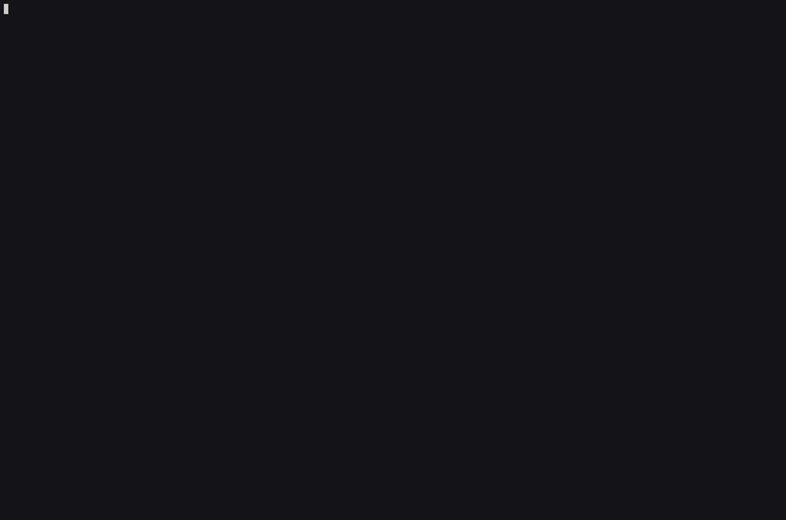
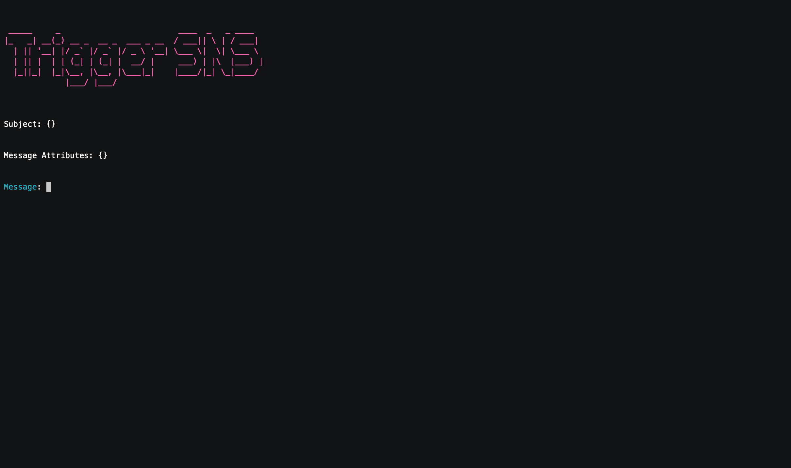
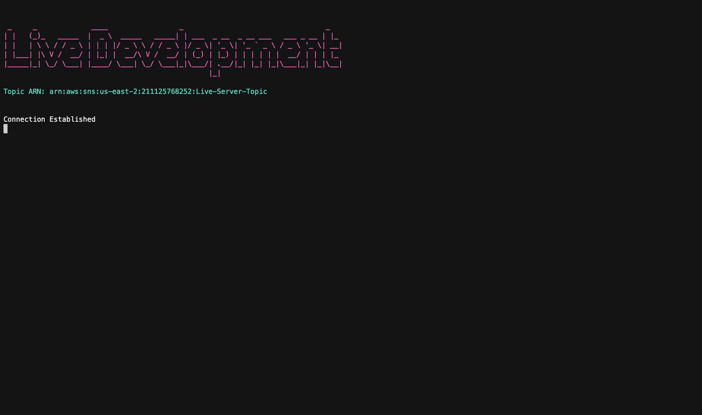

# Synchronizing Local Changes with AWS in Real-Time

Coming Soon...
<!-- Working with AWS Lambda introduces unique challenges compared to traditional server-based setups. Lambda functions are ephemeral and event-driven, terminating immediately after their tasks are completed. This nature complicates local development and testing.

To mitigate these issues, AWS developed the Serverless Application Model (SAM), which facilitates the deployment of serverless applications with YAML configurations and supports local emulation via the SAM CLI. However, SAM faces difficulties with complex applications, presents a steep learning curve, and its local testing features often fall short of replicating the complete AWS environment, potentially leading to inconsistencies.

To improve the development experience, Lambda Forge introduces a different solution. Instead of trying to locally emulate Lambda functions, Lambda Forge deploys a stub function to AWS and utilizes the [MQTT over Websockets](https://docs.aws.amazon.com/iot/latest/developerguide/protocols.html) protocol to establish a connection to a local server running on the developer's machine. This configuration proxies requests intended for the AWS Lambda function directly to the local environment, thereby facilitating an accurate replication of cloud conditions and enabling seamless local development.

## Live Development

To start the live development server, simply run:

```
forge live $FUNCTION-NAME
```

Lambda Forge automatically deploys a function that connects to your local machine and generates the necessary certificates to secure this connection. By default, it sets up an API Gateway endpoint to trigger the Lambda function. The endpoint is specified in your `config.py` file and can be accessed using any HTTP method. If the Lambda function isn’t linked to an API Gateway, the endpoint will default to the function's name.

Once the connection is established, any request sent to the generated URL will be redirected to your local machine. This allows your local Lambda function to receive and process requests in real time, enabling you to update, test, and modify your code on the fly.

Below is demonstrated a live development server for the `HelloWorld` function:



Note that when the provided URL is accessed, the request is proxied to the local machine. This setup allows us to dynamically test and modify the response of the Lambda function in real-time, changing it from `Hello World!` to `Hello Lambda Forge Tutorial!`."

While the API Gateway is the default trigger for the live development, it's not the only trigger option available.

Currently, you can initiate live development sessions using the following triggers:

- Api Gateway
- SNS
- SQS
- Event Bridge
- S3

## Triggers

Unlike the API Gateway, which allows for straightforward testing via browsers or tools like Postman and Insomnia, alternative triggers such as SNS, S3, and CloudWatch Events are not as readily accessible. These triggers generally necessitate the use of custom code or involve manual setup via the AWS Management Console.

To make these triggers as approachable and easy to test as the API Gateway, Lambda Forge has introduced a dedicated CLI command. This command permits developers to publish messages directly to the trigger's configured resource. This functionality not only streamlines the testing process but also ensures that testing Lambda functions with various triggers is as simple and efficient as using the API Gateway.

To trigger a service, use the following command:

```
forge trigger $SERVICE_NAME
```

### Live Development with SNS

In your terminal, enter the following command to activate SNS as the trigger:

```
forge trigger sns
```

Open a new terminal tab and start the live server by running:

```
forge live HelloWorld --trigger sns
```

Those commands are going to set up two separate processes in different terminal tabs. Below, we illustrate how messages sent through the SNS trigger are processed by the live server.




When you send a message to the SNS trigger, it is automatically forwarded to the live topic and subsequently processed by the associated Lambda function. This ensures seamless integration and handling within your live development session. -->
