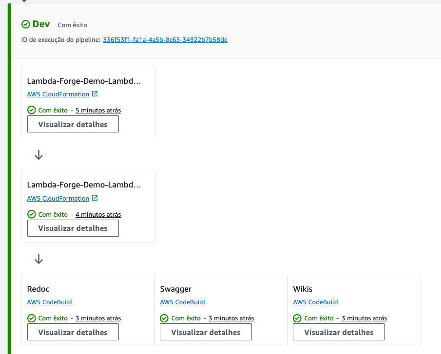
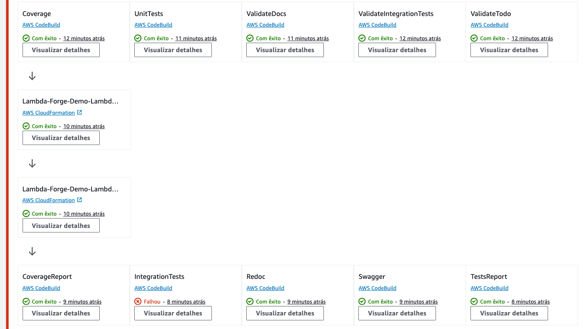
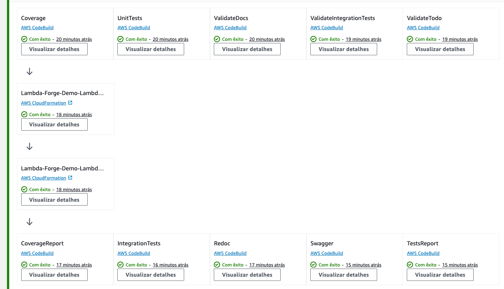
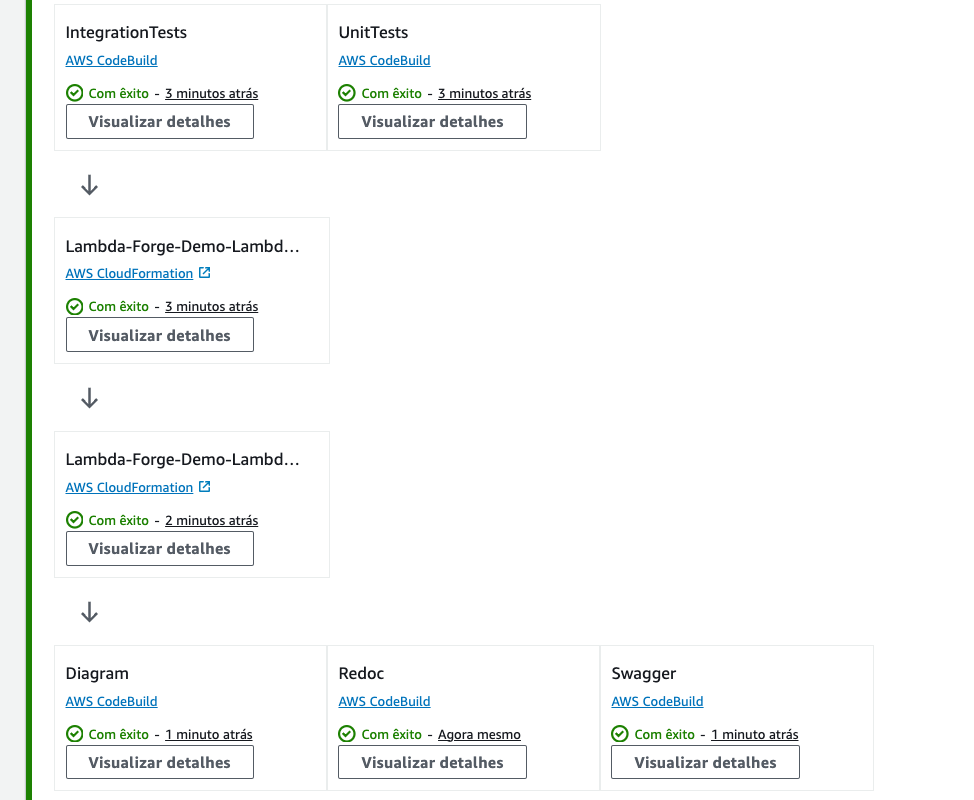
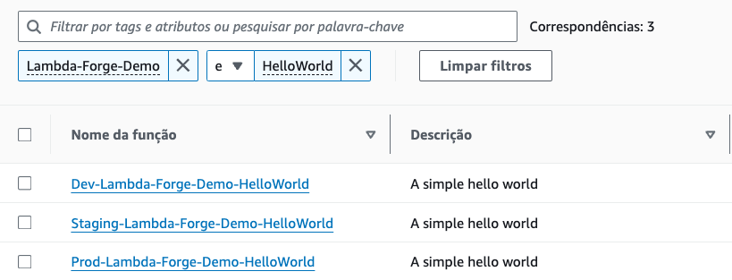

# Multi-Stage Environments With AWS CodePipeline

In practical scenarios, it is highly recommended to adopt a multi-stage development approach. This strategy allows you to freely develop and test your code in isolated environments without affecting your live production environment and, consequently, the real-world users of your application.

In Lambda Forge, the pipelines for development, staging, and production are meticulously organized within distinct files, found at `infra/stacks/dev_stack.py`, `infra/stacks/staging_stack.py`, and `infra/stacks/prod_stack.py`, respectively.

Each stage is designed to operate with its own set of isolated resources, to ensure that changes in one environment do not inadvertently affect another.

<div class="admonition note">
<p class="admonition-title">Note</p>
<p>Lambda Forge provides a suggested pipeline configuration for each stage of deployment. You're encouraged to customize these pipelines to fit your project's needs. Whether adding new steps, adjusting existing ones, reordering or even removing some of them.
</p>
</div>

## Development Environment

The `Development` environment is where the initial coding and feature implementation occur, allowing developers to make frequent changes and test new ideas in an isolated environment.

This environment is strategically structured to facilitate rapid deployments, allowing new features to be rolled out directly without undergoing any preliminary validation steps. It functions essentially as a sandbox environment, providing developers with a space to both develop and test new features in a fast-paced and flexible setting. This approach enables immediate feedback and iterative improvements, streamlining the development process.

### Development Environment Configuration

This section details the setup process for the development environment.

```python title="infra/stacks/dev_stack.py" linenums="1"
import aws_cdk as cdk
from aws_cdk import aws_codebuild as codebuild
from aws_cdk import pipelines as pipelines
from aws_cdk.pipelines import CodePipelineSource
from constructs import Construct
from infra.stages.deploy import DeployStage

from lambda_forge.constants import ECR
from lambda_forge.context import context
from lambda_forge.steps import CodeBuildSteps


@context(stage="Dev", resources="dev")
class DevStack(cdk.Stack):
    def __init__(self, scope: Construct, context, **kwargs) -> None:
        super().__init__(scope, context.create_id("Stack"), **kwargs)

        source = CodePipelineSource.git_hub(f"{context.repo['owner']}/{context.repo['name']}", "dev")

        pipeline = pipelines.CodePipeline(
            self,
            "Pipeline",
            pipeline_name=context.create_id("Pipeline"),
            synth=pipelines.ShellStep("Synth", input=source, commands=["cdk synth"]),
            code_build_defaults=pipelines.CodeBuildOptions(
                build_environment=codebuild.BuildEnvironment(
                    build_image=codebuild.LinuxBuildImage.from_docker_registry(ECR.LATEST),
                )
            ),
        )

        steps = CodeBuildSteps(self, context, source=source)

        # post
        swagger = steps.swagger()
        redoc = steps.redoc()

        pipeline.add_stage(DeployStage(self, context), post=[swagger, redoc])
```

On line 10, the `context` decorator assigns the stage name as `Dev` and configures the use of resources tagged as `dev` in the `cdk.json` file. Moreover, it imports some additional configuration variables from the `cdk.json` file, assigning them to the argument named `context`.

Additionally, we incorporate the source code from the `dev` branch hosted on GitHub into the pipeline. Subsequently, we finalize the deployment of the Lambda functions by activating the `DeployStage`. Post-deployment, we generate `Swagger` and `Redoc` documentation using a helper class provided by Lambda Forge. This class utilizes the public Docker image hosted on ECR described in the previous chapter to facilitate these operations.

### Dev Pipeline Workflow

The diagram below succinctly illustrates the default pipeline configuration for the `Dev` stage and established within the AWS CodePipeline.

<div style="text-align:center;">

```mermaid
graph TD;
    Source --> Build;
    Build --> UpdatePipeline
    UpdatePipeline --> Assets
    Assets --> Deployment
    Deployment --> Redoc
    Deployment --> Swagger
```

</div>

### Adding Wikis

For project success through teamwork, prioritizing knowledge sharing is key. Leveraging wikis facilitates seamless information dissemination, ensuring everyone is on the same page.

First, let's create a markdown file that we'll use as our document.

```
docs/
└── wikis/
    └── wiki.md
```

Let's proceed by updating the pipeline to generate the S3 artifact containing our wikis.

```python title="infra/stacks/dev_stack.py" linenums="38" hl_lines="4-11 18"
        # post
        redoc = steps.redoc()
        swagger = steps.swagger()
        wikis = [
            {
                "title": "Wiki",
                "file_path": "docs/wikis/wiki.md",
                "favicon": "https://docs.lambda-forge.com/images/favicon.png",
            }
        ]
        wikis = steps.wikis(wikis)

        pipeline.add_stage(
            DeployStage(self, context),
            post=[
                redoc,
                swagger,
                wikis,
            ]
        )
```

Below is the diagram illustrating the updated pipeline configuration:

<div style="text-align:center;">

```mermaid
graph TD;
    Source --> Build;
    Build --> UpdatePipeline[Update Pipeline]
    UpdatePipeline --> Assets
    Assets --> Deployment
    Deployment --> Redoc
    Deployment --> Swagger
    Deployment --> Wikis
```

</div>

### Deploying the Dev Environment

After committing and pushing the code to Github, our pipeline should be triggered and updated with the latest configurations.



## Staging Environment

The `Staging` environment serves as a near-replica of the production environment, enabling thorough testing and quality assurance processes to catch any bugs or issues before they reach the end-users.

### Staging Environment Configuration

Let's take a deeper look in the staging configuration file.

```python title="infra/stacks/staging_stack.py" linenums="1"
import aws_cdk as cdk
from aws_cdk import aws_codebuild as codebuild
from aws_cdk import pipelines as pipelines
from aws_cdk.pipelines import CodePipelineSource
from constructs import Construct
from infra.stages.deploy import DeployStage

from lambda_forge.constants import ECR
from lambda_forge.context import context
from lambda_forge.steps import CodeBuildSteps


@context(stage="Staging", resources="staging")
class StagingStack(cdk.Stack):
    def __init__(self, scope: Construct, context, **kwargs) -> None:
        super().__init__(scope, context.create_id("Stack"), **kwargs)

        source = CodePipelineSource.git_hub(f"{context.repo['owner']}/{context.repo['name']}", "staging")

        pipeline = pipelines.CodePipeline(
            self,
            "Pipeline",
            pipeline_name=context.create_id("Pipeline"),
            synth=pipelines.ShellStep("Synth", input=source, commands=["cdk synth"]),
            code_build_defaults=pipelines.CodeBuildOptions(
                build_environment=codebuild.BuildEnvironment(
                    build_image=codebuild.LinuxBuildImage.from_docker_registry(ECR.LATEST),
                )
            ),
        )

        steps = CodeBuildSteps(self, context, source=source)

        # pre
        unit_tests = steps.unit_tests()
        coverage = steps.coverage()
        validate_docs = steps.validate_docs()
        validate_integration_tests = steps.validate_integration_tests()
        validate_todo = steps.custom_step(
            name="ValidateTodo", commands=["python infra/scripts/validate_todo.py"]
        )

        # post
        redoc = steps.redoc()
        swagger = steps.swagger()
        integration_tests = steps.integration_tests()
        tests_report = steps.tests_report()
        coverage_report = steps.coverage_report()

        pipeline.add_stage(
            DeployStage(self, context),
            pre=[
                unit_tests, 
                coverage, 
                validate_integration_tests, 
                validate_docs, 
                validate_todo
            ],
            post=[
                redoc,
                swagger,
                integration_tests,
                tests_report,
                coverage_report,
            ],
        )
```

Similar to the `Dev` environment, this environment is named `Staging`, with resources designated as `staging` in the `cdk.json` file. We also integrate the source code from the `staging` branch on GitHub into the pipeline. However, in contrast to Dev, the Staging environment incorporates stringent quality assurance protocols prior to deployment.

### Staging Pipeline Workflow

The diagram below succinctly illustrates the default pipeline configuration for the `Staging` stage and established within the AWS CodePipeline.

<div style="text-align:center;">

```mermaid
graph TD;
    Source --> Build;
    Build --> UpdatePipeline
    UpdatePipeline --> Assets
    Assets --> UnitTests
    Assets --> Coverage
    Assets --> ValidateDocs
    Assets --> ValidateIntegrationTests
    UnitTests --> Deploy
    Coverage --> Deploy
    ValidateDocs --> Deploy
    ValidateIntegrationTests --> Deploy
    Deploy --> Redoc
    Deploy --> Swagger
    Deploy --> IntegrationTests
    Deploy --> TestsReport
    Deploy --> CoverageReport
```

</div>

### Adding the ValidateTodo Step

Let's fine-tune our pipeline by incorporating the `ValidateTodo` step, which we devised during the previous session. This step will scan files for any TODO comments, promptly raising an error if one is detected.

```python title="infra/stacks/staging_stack.py" linenums="38" hl_lines="6-9 27"
        # pre
        unit_tests = steps.unit_tests()
        coverage = steps.coverage()
        validate_docs = steps.validate_docs()
        validate_integration_tests = steps.validate_integration_tests()
        validate_todo = steps.custom_step(
            name="ValidateTodo",
            commands=["python infra/scripts/validate_todo.py"]
        )

        # post
        redoc = steps.redoc()
        swagger = steps.swagger()
        integration_tests = steps.integration_tests()
        tests_report = steps.tests_report()
        coverage_report = steps.coverage_report()

        pipeline.add_stage(
            DeployStage(self, context),
            pre=[
                unit_tests,
                coverage,
                validate_docs,
                validate_todo,
                validate_integration_tests,
            ],
            post=[
                redoc,
                swagger,
                integration_tests,
                tests_report,
                coverage_report,
            ],
        )
```

We've introduced the validate todo step prior to deployment. Below, you'll find the updated pipeline configuration.

<div style="text-align:center;">

```mermaid
graph TD;
    Source --> Build;
    Build --> UpdatePipeline
    UpdatePipeline --> Assets
    Assets --> UnitTests
    Assets --> Coverage
    Assets --> ValidateDocs
    Assets --> ValidateIntegrationTests
    Assets --> ValidateTodo
    UnitTests --> Deploy
    Coverage --> Deploy
    ValidateDocs --> Deploy
    ValidateTodo --> Deploy
    ValidateIntegrationTests --> Deploy
    Deploy --> CoverageReport
    Deploy --> IntegrationTests
    Deploy --> Redoc
    Deploy --> Swagger
    Deploy --> TestsReport
```

</div>

### Deploying the Staging Environment

Next, let's deploy the staging environment with CDK, adhering to the naming conventions established by Forge:

```
forge deploy --stack Staging
```

After some minutes, a new pipeline named `Staging-Lambda-Forge-Demo-Stack` is created on AWS CodePipeline.


In the staging environment, we conduct rigorous testing to ensure the robustness of our applications. Integration tests are particularly vital as they simulate real-world scenarios in an environment closely mirroring production.

Let's take the `HelloWorld` integration test as example.

```python title="functions/hello_world/integration.py" hl_lines="9 11"
import pytest
import requests
from lambda_forge.constants import BASE_URL


@pytest.mark.integration(method="GET", endpoint="/hello_world")
def test_hello_world_status_code_is_200():

    response = requests.get(url=f"{BASE_URL}/hello_world")

    assert response.status_code == 200
```

Note that, this integration test is actually sending a `GET` request to the deployed staging `/hello_world` endpoint and expecting `200` as the status code.

==**However, given this is our initial deployment, the BASE URL has not been established yet, leading the IntegrationTests step to fail.**==



### Resolving the Initial Staging Deployment Error

To address this issue, we need to set up the BASE URL specifically for the integration tests. Follow the guidelines provided in the [Locating The Api Gateway Base URL on CloudFormation](https://docs.lambda-forge.com/articles/locating-the-base-url/") article to find your base URL.

Having the BASE URL, it must then be incorporated into your `cdk.json` file under the `base_url` key. This adjustment ensures that all integration tests can interact with the staging environment seamlessly for automated testing.

```json title="cdk.json" linenums="50"
    "base_url": "https://01gezhxsf2.execute-api.us-east-2.amazonaws.com/staging"
```

Once the base URL is properly configured for the integration tests, commit your changes and push the updated code to GitHub once again. Following these adjustments, the pipeline should successfully complete its run.



## Production Environment

The `Production` environment represents the phase where the tested and stable version of the software is deployed. This version is accessible to end-users and operates within the live environment. It is imperative that this stage remains the most safeguarded, permitting only fully vetted and secure code to be deployed. This precaution helps in minimizing the risk of exposing end-users to bugs or undesirable functionalities, ensuring a seamless and reliable user experience.

### Production Environment Configuration

```python
import aws_cdk as cdk
from aws_cdk import aws_codebuild as codebuild
from aws_cdk import pipelines
from aws_cdk.pipelines import CodePipelineSource
from constructs import Construct
from infra.stages.deploy import DeployStage

from lambda_forge.constants import ECR
from lambda_forge.context import context
from lambda_forge.steps import CodeBuildSteps


@context(stage="Prod", resources="prod")
class ProdStack(cdk.Stack):
    def __init__(self, scope: Construct, context, **kwargs) -> None:
        super().__init__(scope, context.create_id("Stack"), **kwargs)

        source = CodePipelineSource.git_hub(f"{context.repo['owner']}/{context.repo['name']}", "main")

        pipeline = pipelines.CodePipeline(
            self,
            "Pipeline",
            pipeline_name=context.create_id("Pipeline"),
            synth=pipelines.ShellStep("Synth", input=source, commands=["cdk synth"]),
            code_build_defaults=pipelines.CodeBuildOptions(
                build_environment=codebuild.BuildEnvironment(
                    build_image=codebuild.LinuxBuildImage.from_docker_registry(ECR.LATEST),
                )
            ),
        )

        steps = CodeBuildSteps(self, context, source=source)

        # pre
        unit_tests = steps.unit_tests()
        integration_tests = steps.integration_tests()

        # post
        diagram = steps.diagram()
        redoc = steps.redoc()
        swagger = steps.swagger()

        pipeline.add_stage(
            DeployStage(self, context),
            pre=[
                unit_tests,
                integration_tests,
            ],
            post=[
                diagram,
                redoc,
                swagger,
            ],
        )
```

This environment is named `Prod` and the resources used are provenient from the `prod` key in the `cdk.json` file. Additionally, the `main` branch on GitHub is being used to trigger the pipeline.

Considering the paramount importance of security and integrity in our production environment, we meticulously replicate tests and reinforce safeguards prior to deployment. This rigorous process guarantees that any modifications adhere to our stringent quality benchmarks, thereby safeguarding against vulnerabilities and upholding a seamless user experience. Following this, we proceed to generate the Swagger and Redoc docs alongside the AWS Architecture Diagram for our application.

### Production Pipeline Workflow

The following diagram visually represents the configuration established in AWS CodePipeline.

<div style="text-align:center;">

```mermaid
graph TD;
    Source --> Build;
    Build --> UpdatePipeline
    UpdatePipeline --> Assets
    Assets --> IntegrationTests
    Assets --> UnitTests
    IntegrationTests --> Deployment
    UnitTests --> Deployment
    Deployment --> Diagram
    Deployment --> Redoc
    Deployment --> Swagger
```

</div>

### Deploying the Production Environment

Deploy your production environment using the AWS CDK, adhering to the naming conventions.

```
forge deploy --stack Prod
```

Executing this command initiates the creation of a new pipeline in AWS CodePipeline, designed to automate our deployment process.


In just a matter of minutes, the pipeline is expected to finish its run, seamlessly deploying our functions into the production environment.



## Creating new Pipelines

Feel free to create as many pipelines as you need. Just remember to instantiate them in the `app.py` file located at the root of your project.

```python title="app.py" hl_lines="2-4 8-10"
import aws_cdk as cdk
from infra.stacks.dev_stack import DevStack
from infra.stacks.staging_stack import StagingStack
from infra.stacks.prod_stack import ProdStack

app = cdk.App()

DevStack(app)
StagingStack(app)
ProdStack(app)

app.synth()
```

<div class="admonition note">
<p class="admonition-title">Note</p>
<p>
You can deploy all pipelines at once by using the following command:

```
forge deploy --all
```

</p>
</div>

## Overview

By adhering to the instructions outlined in this tutorial, you are now equipped with three distinct CI/CD pipelines. Each pipeline corresponds to a specific stage of the development lifecycle, directly linked to the `dev`, `staging`, and `main` branches in your GitHub repository.

These pipelines ensure that changes made in each branch are automatically integrated and deployed to the appropriate environment, streamlining the process from development to production.


Furthermore, you have deployed three unique stack of functions, each corresponding to a different environment:



- **Dev**: [https://tbd4it3lph.execute-api.us-east-2.amazonaws.com/dev/hello_world](https://tbd4it3lph.execute-api.us-east-2.amazonaws.com/dev/hello_world)
- **Staging**: [https://01gezhxsf2.execute-api.us-east-2.amazonaws.com/staging/hello_world](https://01gezhxsf2.execute-api.us-east-2.amazonaws.com/staging/hello_world)
- **Prod**: [https://n5lzkkuj51.execute-api.us-east-2.amazonaws.com/prod/hello_world](https://n5lzkkuj51.execute-api.us-east-2.amazonaws.com/prod/hello_world)

Each link directs you to the corresponding function deployed within its respective environment, demonstrating the successful separation and management of environments through your CI/CD workflows.
