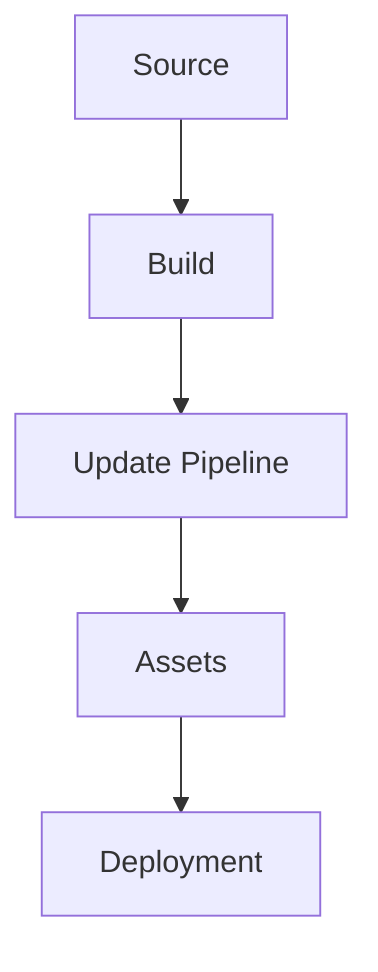
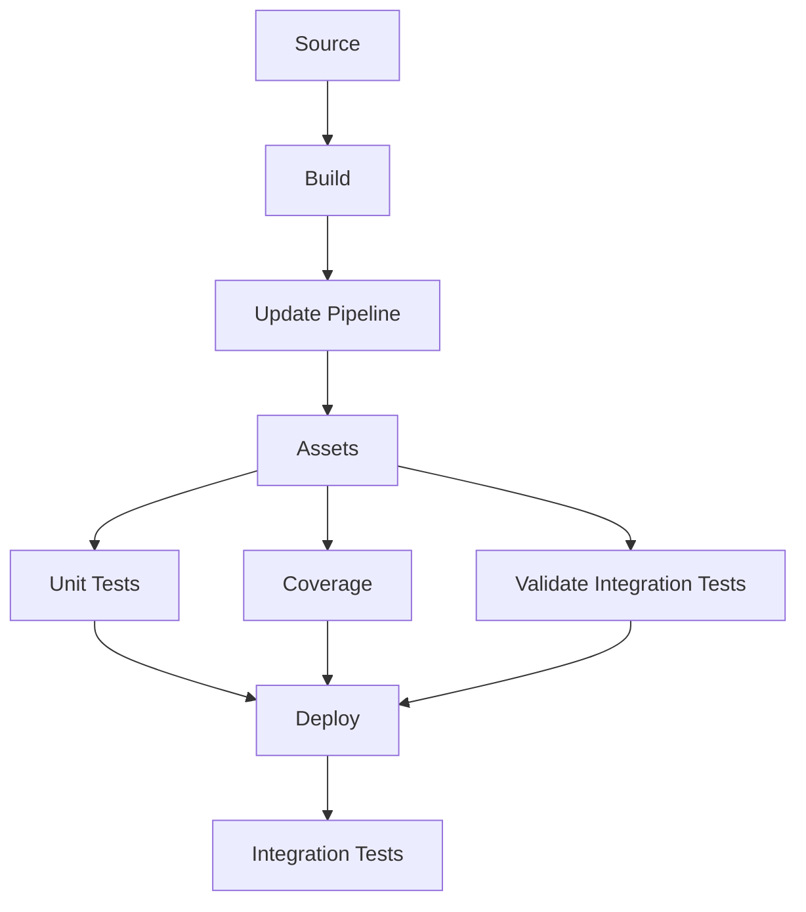
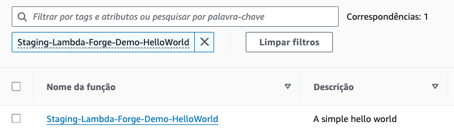
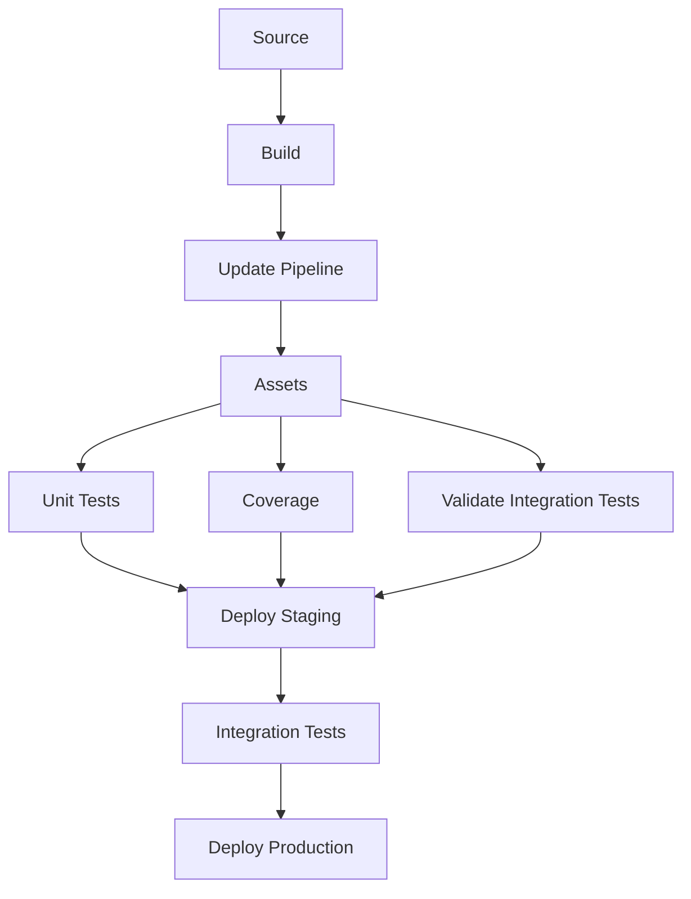
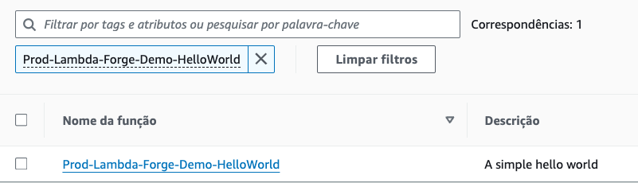
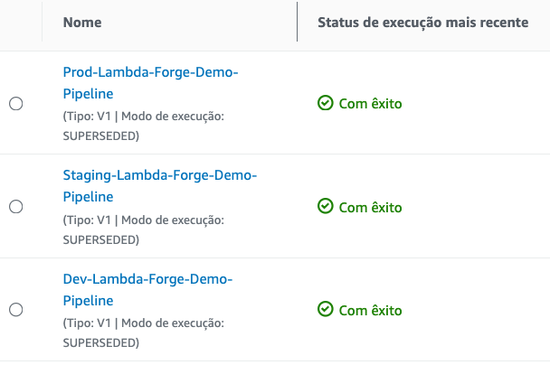

# Multi-Stage Environments With AWS CodePipeline

In practical scenarios, it is highly recommended to adopt a multi-stage development approach. This strategy allows you to freely develop and test your code in isolated environments without affecting your live production environment and, consequently, the real-world users of your application.

In Lambda Forge, the pipelines for development, staging, and production are meticulously organized within distinct files, found at `infra/stacks/dev_stack.py`, `infra/stacks/staging_stack.py`, and `infra/stacks/prod_stack.py`, respectively.

Each stage is designed to operate with its own set of isolated resources, to ensure that changes in one environment do not inadvertently affect another.

<div class="admonition note">
<p class="admonition-title">Note</p>
Lambda Forge provides a suggested pipeline configuration for each stage of deployment. You're encouraged to customize these pipelines to fit your project's needs. Whether adding new steps, adjusting existing ones, reordering or even removing some of them.

</div>

## Development Environment

The `Development` environment is where the initial coding and feature implementation occur, allowing developers to make frequent changes and test new ideas in an isolated environment.

This environment is strategically structured to facilitate rapid deployments, allowing new features to be rolled out directly without undergoing any preliminary validation steps. It functions essentially as a sandbox environment, providing developers with a space to both develop and test new features in a fast-paced and flexible setting. This approach enables immediate feedback and iterative improvements, streamlining the development process.

### Configuring the Development Environment

This section details the setup process for the development environment.

```python title="infra/stacks/dev_stack.py" linenums="1"
import aws_cdk as cdk
from aws_cdk import pipelines as pipelines
from aws_cdk.pipelines import CodePipelineSource
from constructs import Construct
from lambda_forge import context

from infra.stages.deploy import DeployStage


@context(stage="Dev", resources="dev")
class DevStack(cdk.Stack):
    def __init__(self, scope: Construct, context, **kwargs) -> None:
        super().__init__(scope, f"{context.stage}-{context.name}-Stack", **kwargs)

        source = CodePipelineSource.git_hub(
            f"{context.repo['owner']}/{context.repo['name']}", "dev"
        )

        pipeline = pipelines.CodePipeline(
            self,
            "Pipeline",
            synth=pipelines.ShellStep(
                "Synth",
                input=source,
                install_commands=[
                    "pip install lambda-forge aws-cdk-lib",
                    "npm install -g aws-cdk",
                ],
                commands=[
                    "cdk synth",
                ],
            ),
            pipeline_name=f"{context.stage}-{context.name}-Pipeline",
        )

        pipeline.add_stage(DeployStage(self, context))
```

On line 10, the `context` decorator assigns the stage name as `Dev` and configures the use of resources tagged as `dev` in the `cdk.json` file. Moreover, it imports some additional configuration variables from the `cdk.json` file, assigning them to the argument named `context`.

```json title="cdk.json" linenums="41"
    "region": "us-east-2",
    "account": "",
    "name": "Lambda-Forge-Demo",
    "repo": {
      "owner": "$GITHUB-OWNER",
      "name": "$GITHUB-REPO"
    },
    "bucket": "",
    "coverage": 80,
    "dev": {
        "arns": {}
    },
    "staging": {
        "arns": {}
    },
    "prod": {
        "arns": {}
    }
```

Additionally, we incorporate the source code from the `dev` branch hosted on GitHub into the pipeline. Subsequently, we finalize the deployment of the Lambda functions by activating the `DeployStage`.

### Development Pipeline Workflow

As the deployment of the Development Environment has been covered in previous sections, we'll not revisit those steps here. However, the diagram below succinctly illustrates the pipeline configuration established within the AWS CodePipeline.

<div style="text-align:center;">



</div>

## Staging Environment

The `Staging` environment serves as a near-replica of the production environment, enabling thorough testing and quality assurance processes to catch any bugs or issues before they reach the end-users.

### Configuring the Staging Environment

Let's take a deeper look in the staging configuration file.

```python title="infra/stacks/staging_stack.py" linenums="1"
import aws_cdk as cdk
from aws_cdk import pipelines as pipelines
from aws_cdk.pipelines import CodePipelineSource
from constructs import Construct
from lambda_forge import Steps, context

from infra.stages.deploy import DeployStage


@context(stage="Staging", resources="staging")
class StagingStack(cdk.Stack):
    def __init__(self, scope: Construct, context, **kwargs) -> None:
        super().__init__(scope, f"{context.stage}-{context.name}-Stack", **kwargs)

        source = CodePipelineSource.git_hub(
            f"{context.repo['owner']}/{context.repo['name']}", "staging"
        )

        pipeline = pipelines.CodePipeline(
            self,
            "Pipeline",
            synth=pipelines.ShellStep(
                "Synth",
                input=source,
                install_commands=[
                    "pip install lambda-forge aws-cdk-lib",
                    "npm install -g aws-cdk",
                ],
                commands=[
                    "cdk synth",
                ],
            ),
            pipeline_name=f"{context.stage}-{context.name}-Pipeline",
        )

        steps = Steps(self, context, source)

        # pre
        unit_tests = steps.run_unit_tests()
        coverage = steps.run_coverage()
        validate_docs = steps.validate_docs()
        validate_integration_tests = steps.validate_integration_tests()

        # post
        generate_docs = steps.generate_docs()
        integration_tests = steps.run_integration_tests()

        pipeline.add_stage(
            DeployStage(self, context),
            pre=[
                unit_tests,
                coverage,
                validate_integration_tests,
            ],
            post=[integration_tests],
        )
```

Similar to the `Dev` environment, this environment is named `Staging`, with resources designated as `staging` in the `cdk.json` file. We also integrate the source code from the `staging` branch on GitHub into the pipeline. However, in contrast to Dev, the Staging environment incorporates stringent quality assurance protocols prior to deployment.

Before deploying the functions, we execute all unit tests specified in the `unit.py` files. Additionally, we ensure that the code coverage percentage exceeds the threshold set in the `cdk.json` file. We also verify that every function connected to the API Gateway is subjected to at least one integration test, identified by the custom `pytest.mark.integration` decorator.

Once all functions have been successfully deployed, we proceed to conduct integration tests as detailed in the `integration.py` files. Essentially, this procedure entails dispatching an HTTP request to each of the newly deployed functions and ensuring they respond with a 200 status code.

Initially, the project was initiated with the `--no-docs` flag, resulting in the `validate_docs` and `generate_docs` steps being created but not integrated into the pipeline. We will delve into these steps in greater depth, exploring their functionality and potential benefits in the next section.

### Deploying the Staging Environment

First let's create and push the current code to a new branch called `staging`.

```
# Stage your changes
git add .

# Commit with a descriptive message
git commit -m "Deploying the Staging Environment"

# Create/switch to 'staging' branch.
git checkout -b staging

# Push 'staging' to remote.
git push origin staging
```

Next, let's deploy the staging environment with CDK, adhering to the naming conventions established by Forge:

```
cdk deploy Staging-Lambda-Forge-Demo-Stack
```

This command initiates the deployment process. Shortly, AWS CodePipeline will integrate a new pipeline, specifically tailored for the staging environment.


The pipeline's configuration within AWS CodePipeline is depicted below, showcasing the streamlined workflow from source code to deployment:

<div style="text-align:center;">



</div>

The first deployment of the Staging Pipeline often results in failure, a situation that might seem alarming but is actually expected due to the sequence in which components are deployed and tested.

This phenomenon occurs because the integration tests are set to execute immediately after the deployment phase. However, during the first deployment, the BASE URL vital for these tests hasn't been established since it's the inaugural setup of the Staging environment. Consequently, this leads to the failure of the `Integration_Test` phase.


Note that the failure arises **after the deployment phase**, indicating that the Lambda functions have been successfully deployed.

To address this challenge, the solution involves a simple manual step in the AWS Lambda console. Specifically, you'll need to locate the function named `Staging-Lambda-Forge-Demo-HelloWorld`.



Upon finding the function, proceed to `Configurations -> Triggers`. Here, you'll discover the url that was generated for this function during the deployment.


For this tutorial, the complete url is:

- [https://8kwcovaj0f.execute-api.us-east-2.amazonaws.com/staging/hello_world](https://8kwcovaj0f.execute-api.us-east-2.amazonaws.com/staging/hello_world)

Given this, the BASE URL can be deduced as the portion of the URL preceding the `/hello_world` endpoint, which in this case is: `https://8kwcovaj0f.execute-api.us-east-2.amazonaws.com/staging`.

This BASE URL must then be incorporated into your `cdk.json` configuration file under the `base_url` key. This adjustment ensures that all integration tests can interact with the staging environment seamlessly for automated testing.

```json title="cdk.json" linenums="48" hl_lines="3"
    "bucket": "",
    "coverage": 80,
    "base_url": "https://8kwcovaj0f.execute-api.us-east-2.amazonaws.com/staging"
```

With this setup, your integration tests are now aligned with the staging environment, facilitating a smoother and reliable testing phase.

**Finally, commit your changes and push the updated code to GitHub once again.** Following these adjustments, the pipeline should successfully complete its run.

## Production Environment

The `Production` environment represents the phase where the tested and stable version of the software is deployed. This version is accessible to end-users and operates within the live environment. It is imperative that this stage remains the most safeguarded, permitting only fully vetted and secure code to be deployed. This precaution helps in minimizing the risk of exposing end-users to bugs or undesirable functionalities, ensuring a seamless and reliable user experience.

### Configuring the Production Environment

```python

import aws_cdk as cdk
from aws_cdk import pipelines
from aws_cdk.pipelines import CodePipelineSource
from constructs import Construct
from lambda_forge import Steps, context, create_context

from infra.stages.deploy import DeployStage


@context(
    stage="Prod",
    resources="prod",
    staging=create_context(stage="Staging", resources="staging"),
)
class ProdStack(cdk.Stack):
    def __init__(self, scope: Construct, context, **kwargs) -> None:
        super().__init__(scope, f"{context.stage}-{context.name}-Stack", **kwargs)

        source = CodePipelineSource.git_hub(
            f"{context.repo['owner']}/{context.repo['name']}", "main"
        )

        pipeline = pipelines.CodePipeline(
            self,
            "Pipeline",
            synth=pipelines.ShellStep(
                "Synth",
                input=source,
                install_commands=[
                    "pip install lambda-forge aws-cdk-lib",
                    "npm install -g aws-cdk",
                ],
                commands=[
                    "cdk synth",
                ],
            ),
            pipeline_name=f"{context.stage}-{context.name}-Pipeline",
        )

        steps = Steps(self, context.staging, source)

        # pre
        unit_tests = steps.run_unit_tests()
        coverage = steps.run_coverage()
        validate_docs = steps.validate_docs()
        validate_integration_tests = steps.validate_integration_tests()

        # post
        integration_tests = steps.run_integration_tests()

        pipeline.add_stage(
            DeployStage(self, context.staging),
            pre=[
                unit_tests,
                coverage,
                validate_integration_tests,
            ],
            post=[integration_tests],
        )

        # post
        generate_docs = steps.generate_docs()

        pipeline.add_stage(
            DeployStage(self, context),
            post=[],
        )
```

This environment is named `Prod` and the resources used are provenient from the `prod` key in the `cdk.json` file. Additionally, the `main` branch on GitHub is being used to trigger the pipeline. Given the critical need for security and integrity in production, we replicate the staging environment, applying all tests and safeguards again before deploying the production stage. This ensures that any changes meet our high quality standards before production deployment, effectively protecting against vulnerabilities and ensuring a stable user experience.

### Deploying the Production Environment

Firstly, commit and push your code to a new branch named `main` on GitHub

```
# Stage your changes
git add .

# Commit with a descriptive message
git commit -m "Deploying the Production Environment"

# Create/switch to 'main' branch.
git checkout -b main

# Push 'main' to remote.
git push origin main
```

Following the branch setup, deploy your staging environment using the AWS CDK, adhering to the naming conventions provided by Forge.

```
cdk deploy Prod-Lambda-Forge-Demo-Stack
```

Executing this command initiates the creation of a new pipeline in AWS CodePipeline, designed to automate your deployment process.


The following diagram visually represents the configuration established in AWS CodePipeline.

<div style="text-align:center;">



</div>

Upon the successful completion of the pipeline execution, you'll be able to observe a new Lambda function ready and deployed within your AWS Lambda console


To verify the url created, navigate to the newly deployed Lambda function in the AWS Lambda console. Within the function, proceed to `Configurations -> Triggers`. Here, you'll find the URL for the new endpoint that has been activated as part of the deployment process.

For this tutorial, the endpoint URL provided is:

- [https://s6zqhu2pg1.execute-api.us-east-2.amazonaws.com/prod/hello_world](https://s6zqhu2pg1.execute-api.us-east-2.amazonaws.com/prod/hello_world)

## Overview

By adhering to the instructions outlined in this tutorial, you are now equipped with three distinct CI/CD pipelines. Each pipeline corresponds to a specific stage of the development lifecycle, directly linked to the `dev`, `staging`, and `main` branches in your GitHub repository.

These pipelines ensure that changes made in each branch are automatically integrated and deployed to the appropriate environment, streamlining the process from development through to production.



Furthermore, you have deployed three unique functions, each corresponding to a different environment:

- **Dev**: [https://gxjca0e395.execute-api.us-east-2.amazonaws.com/dev/hello_world](https://gxjca0e395.execute-api.us-east-2.amazonaws.com/dev/hello_world)
- **Staging**: [https://8kwcovaj0f.execute-api.us-east-2.amazonaws.com/staging/hello_world](https://8kwcovaj0f.execute-api.us-east-2.amazonaws.com/staging/hello_world)
- **Prod**: [https://s6zqhu2pg1.execute-api.us-east-2.amazonaws.com/prod/hello_world](https://s6zqhu2pg1.execute-api.us-east-2.amazonaws.com/prod/hello_world)

Each link directs you to the corresponding function deployed within its respective environment, demonstrating the successful separation and management of development, staging, and production stages through your CI/CD workflows.

Congratulations! 🎉 You've successfully deployed your Lambda function across three different environments using Lambda Forge! 🚀
