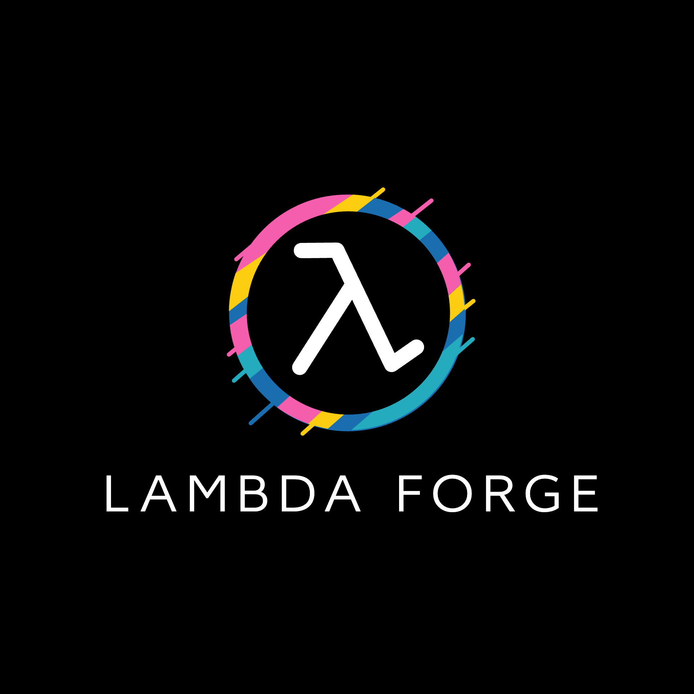

# Introduction

Welcome to Lambda Forge, a cutting-edge framework designed to redefine the deployment and management of AWS Lambda functions. Lambda Forge stands at the intersection of innovation and functionality, offering a seamless pipeline for transitioning code from retrieval to production 🚀.

Lambda Forge is not just about deployment; it's about creating a harmonious environment for your Lambda functions. With an emphasis on a consistent directory structure, it sets the stage for effortless management, deployment, and scalability. Through the synergistic use of AWS CloudFormation stack and AWS CDK, the framework orchestrates the build, test, and deployment processes, efficiently managing code from GitHub repositories across various environments.

One of the hallmark features of Lambda Forge is its dedication to best practices in code organization, testing, and integration. It champions the cause of high-quality, maintainable code standards 📚. The introduction of the Forge command-line interface tool is a game-changer, simplifying the initial setup and enabling a standardized folder structure while pre-configuring essential settings for Lambda functions.

Moreover, Lambda Forge fosters a modular code architecture, promoting unit and integration testing. A standout feature is the automatic generation of Swagger documentation from data classes within each Lambda function, a boon for developers. This enriches the framework, offering developers the tools to produce and access comprehensive API documentation with ease, thereby enhancing the development, management, and deployment journey of Lambda functions with Lambda Forge.
