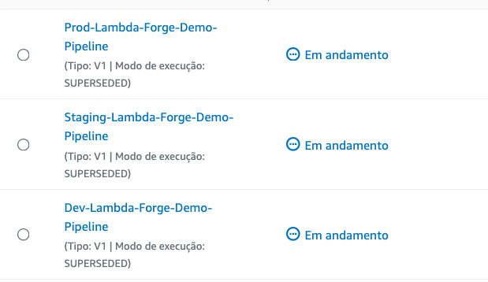

# Multi-Stage Environments With AWS CodePipeline

In practical scenarios, it is highly recommended to adopt a multi-stage development approach. This strategy allows you to freely develop and test your code in isolated environments without affecting your live production environment and, consequently, the real-world users of your application.

In Lambda Forge, the pipelines for development, staging, and production are meticulously organized within distinct files, found at `infra/stacks/dev_stack.py`, `infra/stacks/staging_stack.py`, and `infra/stacks/prod_stack.py`, respectively.

Each stage is designed to operate with its own set of isolated resources, such as database tables, SQS queues, and more, to ensure that changes in one environment do not inadvertently affect another.

<div class="admonition note">
<p class="admonition-title">Note</p>
Lambda Forge provides a suggested pipeline configuration for each stage of deployment. You're encouraged to customize these pipelines to fit your project's needs. Whether adding new steps, adjusting existing ones, reordering or even removing some of them.

</div>

## Development Stage

The `Development` stage is where the initial coding and feature implementation occur, allowing developers to make frequent changes and test new ideas in an isolated environment.

This stage is strategically structured to facilitate rapid deployments, allowing new features to be rolled out directly without undergoing any preliminary validation steps. It functions essentially as a sandbox environment, providing developers with a space to both develop and test new features in a fast-paced and flexible setting. This approach enables immediate feedback and iterative improvements, streamlining the development process.

### Configuring the Dev Stage

Let's examine the configuration file for the development pipeline.

```python title="infra/stacks/dev_stack.py" linenums="1"
import aws_cdk as cdk
from aws_cdk import pipelines as pipelines
from aws_cdk.pipelines import CodePipelineSource
from constructs import Construct
from lambda_forge import context

from infra.stages.deploy import DeployStage


@context(stage="Dev", resources="dev")
class DevStack(cdk.Stack):
    def __init__(self, scope: Construct, context, **kwargs) -> None:
        super().__init__(scope, f"{context.stage}-{context.name}-Stack", **kwargs)

        source = CodePipelineSource.git_hub(
            f"{context.repo['owner']}/{context.repo['name']}", "dev"
        )

        pipeline = pipelines.CodePipeline(
            self,
            "Pipeline",
            synth=pipelines.ShellStep(
                "Synth",
                input=source,
                install_commands=[
                    "pip install lambda-forge aws-cdk-lib",
                    "npm install -g aws-cdk",
                ],
                commands=[
                    "cdk synth",
                ],
            ),
            pipeline_name=f"{context.stage}-{context.name}-Pipeline",
        )

        pipeline.add_stage(DeployStage(self, context))
```

On line 10, the `context` decorator assigns the stage name as `Dev` and configures the use of resources tagged as `dev` in the `cdk.json` file. Moreover, it imports some additional configuration variables from the `cdk.json` file, assigning them to the argument named `context`.

```json title="cdk.json" linenums="41"
    "region": "us-east-2",
    "account": "",
    "name": "Lambda-Forge-Demo",
    "repo": {
      "owner": "$GITHUB-OWNER",
      "name": "$GITHUB-REPO"
    },
    "bucket": "",
    "coverage": 80,
    "dev": {
        "arns": {}
    },
    "staging": {
        "arns": {}
    },
    "prod": {
        "arns": {}
    }
```

==This configuration guarantees that only the ARNs designated for **development** purposes are employed for the functions deployed in this stage.==

Additionally, we incorporate the source code from the `dev` branch hosted on GitHub into the pipeline. Subsequently, we finalize the deployment of the Lambda functions by activating the DeployStage.

### Dev Pipeline Workflow

The diagram below describes the pipeline configuration that will be established within AWS CodePipeline.


## Staging Stage

The `Staging` stage serves as a near-replica of the production environment, enabling thorough testing and quality assurance processes to catch any bugs or issues before they reach the end-users.

### Configuring the Staging Stage

Let's take a deeper look in the staging configuration file.

```python title="infra/stacks/staging_stack.py" linenums="1"
import aws_cdk as cdk
from aws_cdk import pipelines as pipelines
from aws_cdk.pipelines import CodePipelineSource
from constructs import Construct
from lambda_forge import Steps, context

from infra.stages.deploy import DeployStage


@context(stage="Staging", resources="staging")
class StagingStack(cdk.Stack):
    def __init__(self, scope: Construct, context, **kwargs) -> None:
        super().__init__(scope, f"{context.stage}-{context.name}-Stack", **kwargs)

        source = CodePipelineSource.git_hub(
            f"{context.repo['owner']}/{context.repo['name']}", "staging"
        )

        pipeline = pipelines.CodePipeline(
            self,
            "Pipeline",
            synth=pipelines.ShellStep(
                "Synth",
                input=source,
                install_commands=[
                    "pip install lambda-forge aws-cdk-lib",
                    "npm install -g aws-cdk",
                ],
                commands=[
                    "cdk synth",
                ],
            ),
            pipeline_name=f"{context.stage}-{context.name}-Pipeline",
        )

        steps = Steps(self, context, source)

        # pre
        unit_tests = steps.run_unit_tests()
        coverage = steps.run_coverage()
        validate_docs = steps.validate_docs()
        validate_integration_tests = steps.validate_integration_tests()

        # post
        generate_docs = steps.generate_docs()
        integration_tests = steps.run_integration_tests()

        pipeline.add_stage(
            DeployStage(self, context),
            pre=[
                unit_tests,
                coverage,
                validate_integration_tests,
            ],
            post=[integration_tests],
        )
```

Similar to the `Dev` stage, this stage is named `Staging`, with resources designated as `staging` in the `cdk.json` file. We also integrate the source code from the `staging` branch on GitHub into the pipeline. However, in contrast to the Dev stage, the Staging stage incorporates stringent quality assurance protocols prior to deployment.

Before deploying the functions, we execute all unit tests specified in the `unit.py` files. Additionally, we ensure that the code coverage percentage exceeds the threshold set in the `cdk.json` file. We also verify that every function connected to the API Gateway is subjected to at least one integration test, identified by the custom `pytest.mark.integration` decorator.

Once all functions have been successfully deployed, we proceed to conduct integration tests as detailed in the `integration.py` files. Essentially, this procedure entails dispatching an HTTP request to each of the newly deployed functions and ensuring they respond with a 200 status code.

Initially, the project was initiated with the `--no-docs` flag, resulting in the `validate_docs` and `generate_docs` steps being created but not integrated into the pipeline. We will delve into these steps in greater depth, exploring their functionality and potential benefits in the next section.

### Staging Pipeline Workflow

The following diagram illustrates the configuration of the pipeline that will be set up within AWS CodePipeline.


## Production Stage

The `Production` stage represents the phase where the thoroughly tested and stable version of the software is deployed. This version is accessible to end-users and operates within the live environment. It is imperative that this stage remains the most safeguarded, permitting only fully vetted and secure code to be deployed. This precaution helps in minimizing the risk of exposing end-users to bugs or undesirable functionalities, ensuring a seamless and reliable user experience.

### Configuring the Production Stage

```python

import aws_cdk as cdk
from aws_cdk import pipelines
from aws_cdk.pipelines import CodePipelineSource
from constructs import Construct
from lambda_forge import Steps, context, create_context

from infra.stages.deploy import DeployStage


@context(
    stage="Prod",
    resources="prod",
    staging=create_context(stage="Staging", resources="staging"),
)
class ProdStack(cdk.Stack):
    def __init__(self, scope: Construct, context, **kwargs) -> None:
        super().__init__(scope, f"{context.stage}-{context.name}-Stack", **kwargs)

        source = CodePipelineSource.git_hub(
            f"{context.repo['owner']}/{context.repo['name']}", "main"
        )

        pipeline = pipelines.CodePipeline(
            self,
            "Pipeline",
            synth=pipelines.ShellStep(
                "Synth",
                input=source,
                install_commands=[
                    "pip install lambda-forge aws-cdk-lib",
                    "npm install -g aws-cdk",
                ],
                commands=[
                    "cdk synth",
                ],
            ),
            pipeline_name=f"{context.stage}-{context.name}-Pipeline",
        )

        steps = Steps(self, context.staging, source)

        # pre
        unit_tests = steps.run_unit_tests()
        coverage = steps.run_coverage()
        validate_docs = steps.validate_docs()
        validate_integration_tests = steps.validate_integration_tests()

        # post
        integration_tests = steps.run_integration_tests()

        pipeline.add_stage(
            DeployStage(self, context.staging),
            pre=[
                unit_tests,
                coverage,
                validate_integration_tests,
            ],
            post=[integration_tests],
        )

        # post
        generate_docs = steps.generate_docs()

        pipeline.add_stage(
            DeployStage(self, context),
            post=[],
        )
```

In alignment with the setup of previous stages, this phase is designated as `Prod`, with resources marked as `prod` within the `cdk.json` file. Additionally, we link the source code hosted on the `main` branch on GitHub to trigger the pipeline.

Considering the paramount importance of maintaining the maximum security and integrity in the production stage, it is crucial to leverage every possible measure to ensure its consistency. To this end, we undertake a comprehensive approach by redeploying the staging environment, thereby reapplying all the tests and precautionary measures available in the staging setup. This step serves as a critical final check, ensuring that any changes adhere to our stringent quality standards.

Only after the staging environment has been thoroughly vetted and confirmed to operate seamlessly do we advance to deploying in the production environment. This meticulous process helps safeguard the production stage against potential vulnerabilities, ensuring a secure and stable experience for the end-users.

### Production Pipeline Workflow


<!--
#### Customizing Pipeline Steps

In Lambda Forge, pipelines are defined within their specific stack files located at `infra/stacks/dev_stack.py`, `infra/stacks/staging_stack.py`, and `infra/stacks/prod_stack.py`. Below is an outline of the default steps included in each pipeline, along with details on how they function and how you can interact with them.

- **Coverage**: Measures the percentage of your production code covered by unit tests, failing if coverage falls below 80% as default. To view the coverage report, navigate to `Details -> Reports` in CodePipeline.

- **Unit Tests**: Runs unit tests to validate the functionality of individual components within your code. Access the unit test report via `Details -> Reports` in CodePipeline.

- **Validate Docs**: Verifies that all Lambda functions invoked by API Gateway have their Input and Output data classes correctly defined in the `main.py` file.

- **Validate Integration Tests**: This step ensures that all endpoints triggered by the API Gateway are covered by at least one integration test. To achieve this, use the custom decorator `@pytest.mark.integration` and specify the method and endpoint arguments to declare that the test covers a specific endpoint.

- **Generate Docs**: Automatically produces Swagger documentation for all API Gateway endpoints. This requires `Input` and `Output` data classes for each Lambda function in the `main.py` file. Documentation is deployed directly to API Gateway and is accessible at the `/docs` endpoint.

- **Integration Tests**: Performs integration testing to assess the system's overall functionality. Access the integration test report through `Details -> Reports` in CodePipeline.

Lambda Forge provides a suggested pipeline configuration, emphasizing flexibility in its design. You're encouraged to customize these pipelines to fit your project's needs. Whether adding new steps, adjusting existing ones, reordering or even removing them. The framework is designed to accommodate your project's specific requirements. This level of customization ensures that your pipelines align closely with your development, testing, and deployment strategies, providing a robust foundation for your application's continuous integration and delivery processes.

After the pipelines have executed, you may notice that while the Development pipeline succeeds, the Staging and Production pipelines fail.


This failure is expected, It occurs because the integration test step attempts to send a GET request to the deployed Lambda function. However, since the Stack has just been created, the Lambda function's URL is not yet available, causing the test to fail.

```python title="functions/hello_world/integration.py"
import pytest
import requests
from lambda_forge.constants import BASE_URL

@pytest.mark.integration(method="GET", endpoint="/hello_world")
def test_hello_world_status_code_is_200():

    response = requests.get(url=f"{BASE_URL}/hello_world")

    assert response.status_code == 200
```

### Accessing Your Lambda Function

Note that the `Integration_Test` step failed **after** the deployment in the staging pipeline.


This means that both Dev and the Staging Lambda function are successfully deployed.

In this tutorial, we will use the staging URL to test our endpoints, considering it as a pre-production layer. Feel free to utilize the development URL instead if it suits your case better.

Navigate to the AWS Lambda section on AWS and search for the **Staging-Lambda-Forge-Demo-HelloWorld** function in the list of Lambda functions.
<br>


Once you've found your function, click on it to view its details. Proceed by selecting the Configuration tab, followed by Triggers to uncover the integration points.


In this tutorial, the generated URL is:

[https://8kwcovaj0f.execute-api.us-east-2.amazonaws.com/staging/hello_world](https://8kwcovaj0f.execute-api.us-east-2.amazonaws.com/staging/hello_world).

By following the link provided, you should be greeted by a simple "Hello World" message in your web browser, indicating that your Lambda function is operational and accessible via the URL generated by API Gateway.

```json
{
  "message": "Hello World!"
}
```

### Configuring the BASE URL for Integration Tests

With the Lambda function's URL at hand, we identify that the segment before `/hello_world` acts as the BASE URL. For the purposes of this tutorial, the BASE URL is `https://8kwcovaj0f.execute-api.us-east-2.amazonaws.com/staging`. This is the URL you need to copy.

**Proceed to incorporate this URL into your project's configuration by setting it as the value for `base_url` in your `cdk.json` file**.

```{.json title="cdk.json" hl_lines=11 linenums=40}
...
"region": "us-east-2",
"account": "",
"name": "Lambda-Forge-Demo",
"repo": {
    "owner": "$GITHUB-USER",
    "name": "$GITHUB-REPO"
},
"bucket": "",
"coverage": 80,
"base_url": "https://8kwcovaj0f.execute-api.us-east-2.amazonaws.com/staging"
...
```

### Pushing Updated Code to GitHub

With the BASE URL configured for our integration tests, it's time to push the updated code to GitHub and aim for successful integration test outcomes across all deployment stages.

Follow these steps to commit your changes and deploy them across the development, staging, and production branches:

```bash
# Add changes to the staging area
git add .

# Commit the changes with a descriptive message
git commit -m "Configure BASE URL for integration tests"

# Push changes to the 'dev' branch.
git push origin dev

# Switch to the 'staging' branch, merge changes from 'dev', and push
git checkout staging
git merge dev
git push origin staging

# Switch to the 'main' branch, merge changes from 'staging', and push
git checkout main
git merge staging
git push origin main
```

After executing these commands, all associated pipelines should be triggered once again.



Once the execution of all pipelines is complete, you should observe that all stages have successfully passed.


Congratulations! 🎉 You've successfully deployed your very first Lambda function across three distinct stages using Lambda Forge! 🚀

In this tutorial, the links are:

- Dev: [https://gxjca0e395.execute-api.us-east-2.amazonaws.com/dev/hello_world](https://gxjca0e395.execute-api.us-east-2.amazonaws.com/dev/hello_world)
- Staging: [https://8kwcovaj0f.execute-api.us-east-2.amazonaws.com/staging/hello_world](https://8kwcovaj0f.execute-api.us-east-2.amazonaws.com/staging/hello_world)
- Prod: [https://s6zqhu2pg1.execute-api.us-east-2.amazonaws.com/prod/hello_world](https://s6zqhu2pg1.execute-api.us-east-2.amazonaws.com/prod/hello_world) -->
