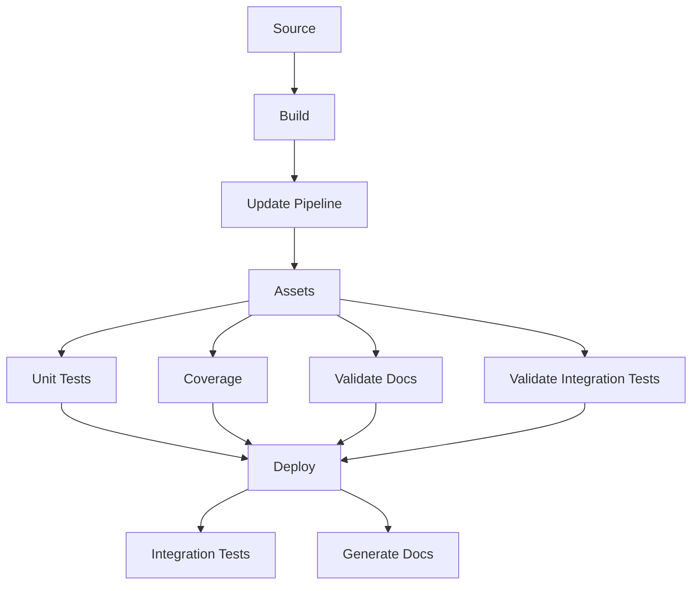
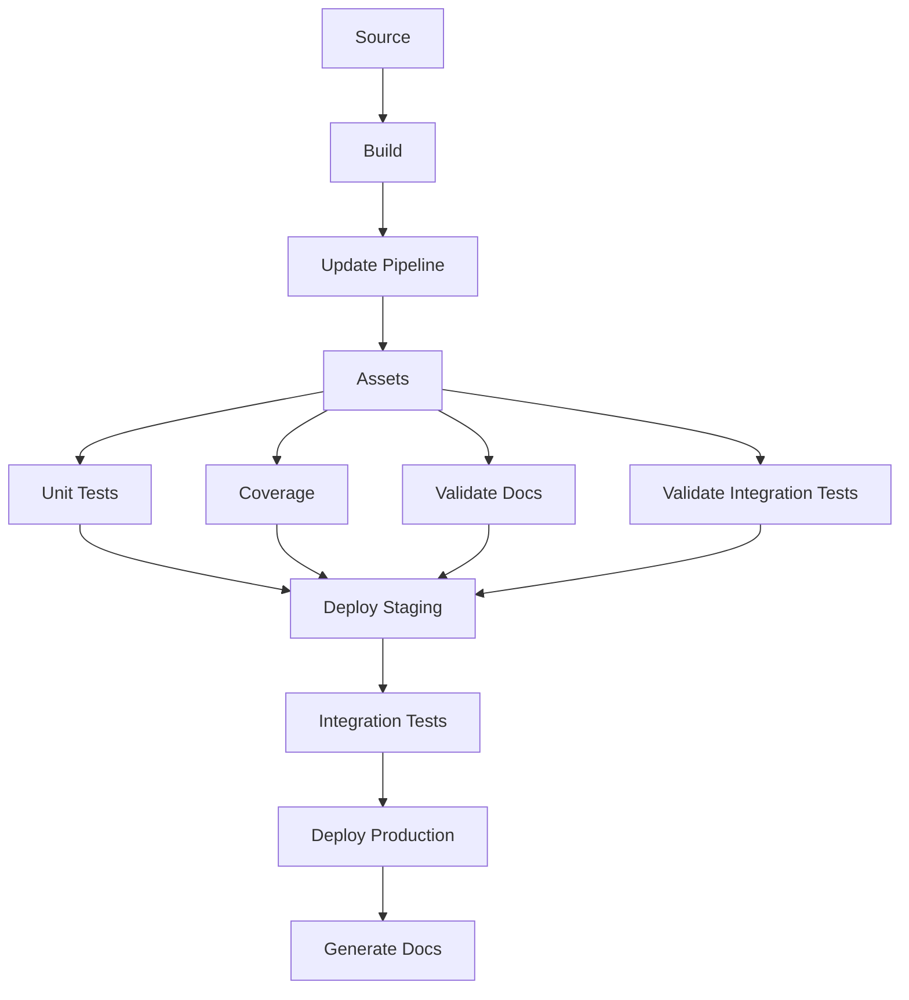

# Generating Docs With Swagger and ReDoc

With our Lambda Function now deployed across three distinct stages, let's set up the docs for our brand new endpoints.

## Configuring the Docs

Inside each `main.py` file, you should include the `Input` and `Output` dataclasses that are going to be the entrypoint for generating the docs. Case you have an endpoint that's expecting a path parameter, you can also include it in the `Path` dataclass.

The code snippet below demonstrates all the types of data you can expect to work with, including simple data types, lists, custom objects, optional fields, and literal types, offering a clear understanding of the input and output contracts for the API.

```python
from dataclasses import dataclass
from typing import List, Optional, Literal

# Define a dataclass for path parameters, useful for API endpoints requiring parameters within the URL path.
@dataclass
class Path:
    id: str

# A custom object class that represents a complex type with multiple fields.
@dataclass
class Object:
    a_string: str
    an_int: int

# The input data class represents the expected structure of the request payload.
@dataclass
class Input:
    a_string: str  # A simple string input
    an_int: int  # A simple integer input
    a_boolean: bool  # A boolean value
    a_list: List[str]  # A list of strings
    an_object: Object  # An instance of the custom 'Object' class defined above
    a_list_of_object: List[Object]  # A list containing instances of 'Object'
    a_literal: Literal["a", "b", "c"]  # A literal type, restricting values to 'a', 'b', or 'c'
    an_optional: Optional[str]  # An optional string, which can be either a string or None

# The output data class represents the endpoint's output.
@dataclass
class Output:
    pass # No fields are defined, implying the output is empty.
```

## Setting Up a S3 Bucket for Documentation

Create an Amazon S3 bucket to serve as the primary storage for your documentation files. Follow these steps to create your S3 bucket:

1. **Access the AWS Management Console**: Open the Amazon S3 console at [https://console.aws.amazon.com/s3/](https://console.aws.amazon.com/s3/).
2. **Create a New Bucket**: Click on the "Create bucket" button. It's important to note that each bucket's name must be globally unique across all of Amazon S3.
3. **Set Bucket Name**: Choose a unique and descriptive name for your bucket. This name will be crucial for accessing your documentation files. Remember, once a bucket name is set, it cannot be changed.
4. **Choose a Region**: Select an AWS Region for your bucket. Choose the same region defined in your `cdk.json`.
5. **Configure Options**: You may leave the default settings or configure additional options like versioning, logging, or add tags according to your needs.
6. **Review and Create**: Before creating the bucket, review your settings. Once everything is confirmed, click "Create bucket".

Once the bucket is created, update your `cdk.json` file with the bucket's name as shown below:

```json title="cdk.json" hl_lines="2 9" linenums="40"
...
"region": "us-east-2",
"account": "",
"name": "Lambda-Forge-Demo",
"repo": {
    "owner": "$GITHUB-USER",
    "name": "$GITHUB-REPO"
},
"bucket": "$S3-BUCKET-NAME",
"coverage": 80,
...
```

## Setting Up Documentation Endpoints

To activate documentation generation, navigate to the `deploy.py` file located at `infra/stages/deploy.py`. Configure your endpoints as illustrated in the following example.

```python title="infra/stages/deploy.py" linenums="1" hl_lines="14 17 20 23"
import aws_cdk as cdk
from constructs import Construct

from infra.stacks.lambda_stack import LambdaStack


class DeployStage(cdk.Stage):
    def __init__(self, scope: Construct, context, **kwargs):
        super().__init__(scope, context.stage, **kwargs)

        lambda_stack = LambdaStack(self, context)

        # Sets up a Swagger-based public endpoint at /docs
        lambda_stack.services.api_gateway.create_docs(authorizer=None)

        # Establishes a Swagger-based private endpoint at /docs/private with the 'secret' authorizer
        lambda_stack.services.api_gateway.create_docs(authorizer="secret", endpoint="/docs/private")

        # Configures a Redoc-based public endpoint at /docs/redoc
        lambda_stack.services.api_gateway.create_docs(authorizer=None, endpoint="/docs/redoc", redoc=True)

        # Sets up a Redoc-based private endpoint at /docs/private/redoc with the 'secret' authorizer
        lambda_stack.services.api_gateway.create_docs(authorizer="secret", endpoint="/docs/private/redoc", redoc=True)
```

This configuration enables both public and private documentation endpoints using Swagger and Redoc, making your API's documentation accessible and versatile.

## Configuring the Pipelines for Docs Generation

==Given that the **development** stage is designed for fast deployment and serves as a sandbox environment, Lambda Forge does not automatically generate documentation for the dev environment==. However, if you wish to include docs generation in your development workflow, replicating the following steps for the dev environment should effectively enable this functionality.

Because the project was started with the `--no-docs` flag, it currently lacks the `validate_docs` and `generate_docs` steps in both the Staging and Production pipelines.

In essence, the `validate_docs` step ensures that all files intended for documentation are correctly configured with the necessary data classes. This step checks for completeness and accuracy in the documentation's underlying structure. On the other hand, the `generate_docs` step takes on the role of creating the documentation artifact itself and deploying it to the S3 bucket configured on the `cdk.json` file.

To incorporate docs generation into your project, you'll need to modify your stack configurations. Specifically, you should enable the `validate_docs` and `generate_docs` steps within your CI/CD pipeline configurations for both Staging and Production environments.

### Configuring the Staging Pipeline

To turn on documentation generation for the staging environment, add `validate_docs` in the pipeline's pre-execution phase and `generate_docs` post-deployment.

```python title="infra/stacks/staging_stack.py" linenums="39", hl_lines="17 19"
    # pre
    unit_tests = steps.run_unit_tests()
    coverage = steps.run_coverage()
    validate_docs = steps.validate_docs()
    validate_integration_tests = steps.validate_integration_tests()

    # post
    generate_docs = steps.generate_docs()
    integration_tests = steps.run_integration_tests()

    pipeline.add_stage(
        DeployStage(self, context),
        pre=[
            unit_tests,
            coverage,
            validate_integration_tests,
            validate_docs, # Validate docs enabled
        ],
        post=[integration_tests, generate_docs], # Generate docs enabled
    )
```

The pipeline configuration will change for the staging environment. The following diagram illustrates the adjusted setup.

<div style="text-align:center;">



</div>

### Configuring the Production Pipeline

Similarly for the Production stack, ensure that `validate_docs` and `generate_docs` are enabled.

```python title="infra/stacks/prod_stack.py" linenums="43", hl_lines="16 26"
    # pre
    unit_tests = steps.run_unit_tests()
    coverage = steps.run_coverage()
    validate_docs = steps.validate_docs()
    validate_integration_tests = steps.validate_integration_tests()

    # post
    integration_tests = steps.run_integration_tests()

    pipeline.add_stage(
        DeployStage(self, context.staging),
        pre=[
            unit_tests,
            coverage,
            validate_integration_tests,
            validate_docs, # Validate docs enabled
        ],
        post=[integration_tests],
    )

    # post
    generate_docs = steps.generate_docs()

    pipeline.add_stage(
        DeployStage(self, context),
        post=[generate_docs], # Generate docs enabled
    )
```

The pipeline configuration will also change change for the staging environment. The following diagram illustrates the adjusted setup.

<div style="text-align:center;">



</div>

## Deploying the Docs

At this point, we have all the necessary components to automatically generate our docs.

To proceed, commit your changes and push them to GitHub using the following commands:

```bash
# Send your changes to stage
git add .

# Commit with a descriptive message
git commit -m "Activating docs for Staging and Production environments"

# Push changes to the 'dev' branch
git push origin dev

# Merge 'dev' into 'staging' and push
git checkout staging
git merge dev
git push origin staging

# Finally, merge 'staging' into 'main' and push
git checkout main
git merge staging
git push origin main
```

After the pipeline completes successfully, the documentation for your API's endpoints will be available through the URLs set up in the `DeployStage` class. This documentation offers detailed insights into the endpoints, including their request formats, response structures, and available query parameters.

For easy access, the documentation for public endpoints in each environment is provided at:

- **Staging Environment**:

  - [https://8kwcovaj0f.execute-api.us-east-2.amazonaws.com/staging/docs](https://8kwcovaj0f.execute-api.us-east-2.amazonaws.com/staging/docs)
  - [https://8kwcovaj0f.execute-api.us-east-2.amazonaws.com/staging/docs/redoc](https://8kwcovaj0f.execute-api.us-east-2.amazonaws.com/staging/docs/redoc)

- **Production Environment**:
  - [https://s6zqhu2pg1.execute-api.us-east-2.amazonaws.com/prod/docs](https://s6zqhu2pg1.execute-api.us-east-2.amazonaws.com/prod/docs)
  - [https://s6zqhu2pg1.execute-api.us-east-2.amazonaws.com/prod/docs/redoc](https://s6zqhu2pg1.execute-api.us-east-2.amazonaws.com/prod/docs/redoc)

Accessing the private endpoints, `/docs/private` for Swagger and `/docs/private/redoc` for Redoc, necessitates the inclusion of the security token generated by the secrets authorizer, as specified in the authorizers section.
